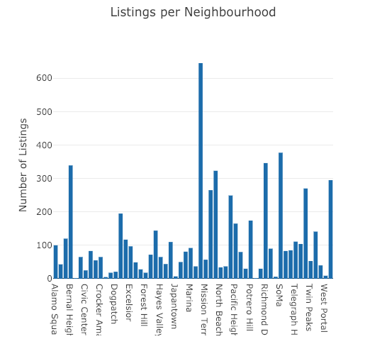

# Airbnb Analysis

Analysis of Airbnb listings in the city of San Francisco. The charts and mapping data is based off of third party scraped data.

## Built With

* [Bootstrap](https://getbootstrap.com/) - The web template used
* Jupyter Notebook - Data cleaning, engineering, formatting. 
* Sqllite - Cleaned Data storage
* Python/flask- Web hosting
* D3 - Charts
* Plotly - Charts

## Authors

* **Dipesh Manandhar** (https://github.com/dipesh267)

